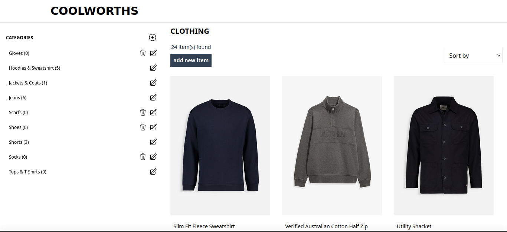

# inventory-application

an online clothing store `CRUD` web application

## Core Features

- [x] create an new `item` and `category`
- [x] read an `item` and `category` from the database
- [x] update an existing `item` and `category`
  - [x] categories must be unique
  - [x] items can have the same names
- [x] delete an existing `item` and `category`
  - [x] any item can be deleted
  - [x] only empty categories can be deleted
- [x] sort items by category
- [x] validate input fields

## Additional Features

- [x] make the application responsive across different screen sizes.
- [x] add and store item images
- [x] sort items by name or price, in ascending and descending order.

## Installation Instructions

- Clone the repo
- Open the `inventory-application` folder
- Run `npm i` from your terminal to install all of the project's dependecies
- Run `npm run serverstart` from your terminal to build and start the application
  - If your browser does not open automatically paste http://localhost:3000 in the address bar of your browser and press Enter

## Lessons Learnt

- Even though `DELETE` and `PUT` are valid `HTTP` methods, they are not valid `HTML5` code. `POST` and `GET` are the only permitted form `method` attribute values. Everything else will send a `GET` request instead.

## Credits

- All the images, and product details along with the design of the website is from: https://woolworths.co.za/clothing/men
